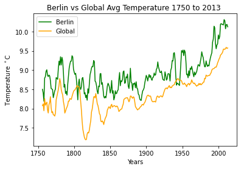

# WeatherTrends

In the field of data analysis data of specific domains plays an important role to
make a decision. The data of a domain like the temperature of local territory and
temperature of global for a specific period of time carry a few valuable insights.
The project Explore Weather Trends provide such type of data and ask to find
out that insight and depict meaningful figures, observations accordingly.  

### Prerequisites

python 3.5, MySQL, pandas, matplotlib.

## Authors

* **MD ABU YUSUF** - [mayusuf](https://github.com/mayusuf)
